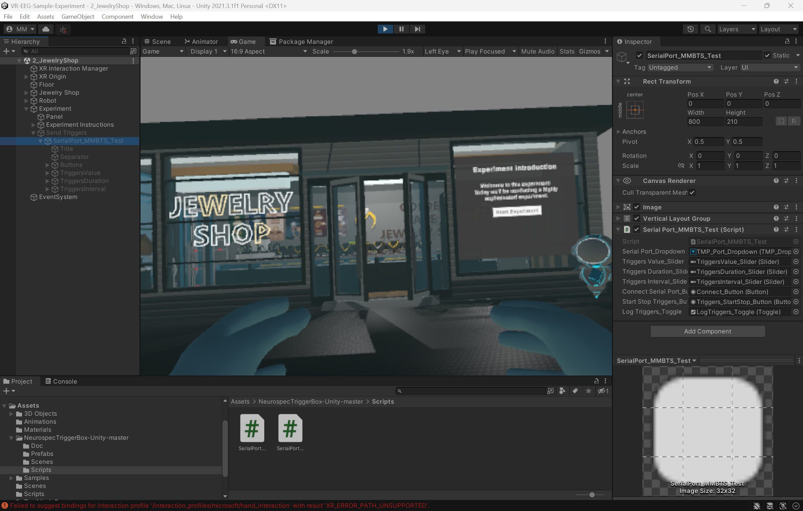

# Sample VR Experiment for Neuroscience Research

This sample virtual reality (VR) experiment is a [Unity](https://unity.com/) project developed by [NEUROSPEC AG](https://www.neurospec.com/). NEUROSPEC AG uses this sample experiment for their workshop on "Unifying VR Environments with State-of-the-Art EEG Research". The aim of this sample VR experiment is to give reseachers (neuroscientists and the like) a template for their VR experiments.



## Experiment Description

The experiment is made up of three simple scenes:

- Welcome Scene
- Trial Scene
- End Scene

During the Welcome Scene, the participant is greeted with a welcome screen. Here, the experimenter can enter the necessary participant ID. The Trial Scene consists of a jewelry shop and a user interface (UI) with instructions on how to send triggers from the VR environment. Once finished, the user can end the experiment directly within the End Scene.

In all three scenes, the participant can walk around using the joysticks on their controllers and interact with selected objects using the trigger buttons. There is no specific task participants have to complete. However, this simple experiment can be extended with a minimal amount of effort to involve participants in nearly any kind of a task. 

## Recommended Peripheral Hardware Components

This VR project has been developed to be used with the following equipment:

- [Meta Quest 2](https://www.meta.com/quest/products/quest-2/) VR headset
- [Meta Quest Link cable](https://www.meta.com/quest/accessories/link-cable/)
- [MMBT-S](https://shop.neurospec.com/mmbt-s-trigger-interface-box) Trigger Interface Box
- High-performance Computer (preferably a gaming computer)

The project includes various sample assets and scripts for combining VR with almost any research-grade EEG or biosignal acquisition system. The experiment has been developed to work with the [Meta Quest 2](https://www.meta.com/quest/products/quest-2/) VR headset. Other VR headsets may work since the project uses the [OpenXR Plugin](https://docs.unity3d.com/Manual/com.unity.xr.openxr.html) from Unity. OpenXR aims to simplify AR/VR development by allowing developers to target a wide range of AR/VR devices.

To synchronise the VR experiment with your EEG or biosignal acquisition system, this experiment makes use of sending TTL trigger markers (8 bits). The project includes the scripts to send triggers through an [MMBT-S Trigger Interface Box](https://shop.neurospec.com/mmbt-s-trigger-interface-box) to the EEG/biosignal acquisition system. The EEG/biosignal acquisition system must be able to receive 8 bit digital trigger markers.

The computer running Unity and Meta Quest Link must comply with the [Meta Quest Link Pre-Requisites](https://www.meta.com/en-gb/help/quest/articles/headsets-and-accessories/oculus-link/meta-quest-link-compatibility/). Ensure your computer has the necessary processing power and graphics card (GPU) to be able to run Unity and Meta Quest Link before installing the software. 

## Getting Started

These instructions will get a copy of this sample VR experiment up and running on your local machine for development purposes.

### OS requirements

For this project to properly run, it is recommended to setup this project and the required environment on a computer running on Windows 10 or [Windows 11](https://www.microsoft.com/software-download/windows11).

This project has been tested to run under Unity for macOS 13.3.1 (Ventura), however, not in combination with the Meta Quest 2. Meta Quest Link is currently not available for macOS. Hence, passing through the virtual environment to the Meta Quest 2 could not be tested under macOS.

### Installation

#### Meta Quest 2 & Meta Quest Link Setup Instructions

This sample VR experiment has been developed to work with the [Meta Quest 2](https://www.meta.com/quest/products/quest-2/) VR headset. To render the VR environment to the Meta Quest 2, Meta Quest Link is required to run simultaneously. Prior to installation, check the [Meta Quest Link Requirements](https://www.meta.com/en-gb/help/quest/articles/headsets-and-accessories/oculus-link/meta-quest-link-compatibility/) page to ensure your computer has the necessary processing power and graphics card (GPU). 

The setup and installation instructions for Meta Quest Link is available at:
[https://developer.oculus.com/documentation/unity/unity-link/](https://developer.oculus.com/documentation/unity/unity-link/)

#### Unity Setup Instructions

This sample VR experiment is developed using [Unity](https://unity.com/) (version 2021.3.1). Newer versions of Unity may work but have not been tested.

To install Unity, follow these steps:
1. Download Unity Hub from: [https://unity.com/download](https://unity.com/download).
2. Install Unity Hub by following the instructions onscreen for guidance through the installation process and setup. *Note: Unity Hub will also install [Visual Studio](https://visualstudio.microsoft.com/) and necessary packages which are required for the development of C# scripts in Unity.*
3. Create a Unity ID: https://id.unity.com/.
4. Open Unity Hub.
5. Sign in with your Unity ID.
6. Click on the profile icon on the top left.
7. Select "Manage licenses".
8. Add a new license by clicking on "Add" on the top right.
9. Either activate your license if you have a paid license or add a free personal license.
10. Close the preferences windows.
11. Download and install Unity version **2021.3.1** from the Unity Download Archive page: [https://unity.com/releases/editor/archive](https://unity.com/releases/editor/archive).

#### Load Sample VR Experiment into Unity

Once Unity is installed, either clone this repository using Git or download it to your local machine. Next, add the project to Unity Hub:
1. Navigate to the "Projects" in the menu bar on the right.
2. Click on the down arrow next to "Add".
3. Select "Add project from disk".
4. Navigate to the root folder of the project repository.
5. Click "Add Project".
6. Verify the correct "Editor Version" is selected: **2021.3.1f1**.

### Project Structure

This sample VR experiment consists of the following files and directories.
```
.
├── Assets
│   ├── 3D Objects
│   ├── Animations
│   ├── Materials
│   ├── NeurospecTriggerBox-Unity-master
│   ├── Samples
│   ├── Scenes
│   ├── Scripts
│   ├── TextMesh Pro
│   ├── XR
│   ├── XRI
│   ├── ...
├── Packages
└── ProjectSettings
└── ...
```

These folders are explained in detail in the table below.
| Folder | Content |
| --- | --- |
| /Assets | This is main experiment project folder. It contains all the necessary assets for the VR environment. |
| /Assets/3D Objects | Contains all 3D objects of this project (e.g., the door of the jewelery store). |
| /Assets/Animations | Contains the animations for the 3D objects. |
| /Assets/Materials | Contains all materials used for styling the 3D objects. |
| /Assets/NeurospecTriggerBox-Unity-master | Contains UI components and scripts for sending trigger markers to the MMBT-S Trigger Interface Box. |
| /Assets/Samples | Contains sample XR intercation toolkit components. |
| /Assets/Scenes | Contains the different experiment scenes. |
| /Assets/Scripts | Contains all scripts for manipulating the VR environment and its assets. |
| /Assets/TextMesh Pro | Contains UI elements for user the forms. |
| /Assets/XR | Contains XR assets for compling the project to VR/AR. |
| /Assets/XRI | Contains XR Interaction Toolkit assets for a bidirectional communication and interaction between the VR environment and VR/AR headset. |
| /Packages | Contains two files for Unity to manage software packages, libraries and the corresponding versions. |
| /ProjectSettings | Contains files with all project and build settings. |

### Running a Project in Unity

After Unity is installed and the project is imported, the only thing left to do is run the project. Note, after opening the project for the first time, Unity needs to connect to the internet to download the necessary packages and libraries. All project and build settings are saved in the "ProjectSettings" folder and hence no additional changes are required to the run the project.

Once Unity has successfully loaded the project, packages and libraries, running the VR environment is as easy as:

1) Connect the Meta Quest 2 VR headset.
2) Turn on the Meta Quest 2 VR headset.
3) Start Meta Quest Link.
4) Click on the play button on top center of Unity.

## Getting Help

If you are having trouble with setting up this sample VR experiment, the MMBT-S, Unity or the Meta Quest ecosystem here are a few online ressources that can help you.

- Unity forum: [https://forum.unity.com/](https://forum.unity.com/)
- Unity installation guide: [https://docs.unity3d.com/2023.2/Documentation/Manual/GettingStartedInstallingUnity.html](https://docs.unity3d.com/2023.2/Documentation/Manual/GettingStartedInstallingUnity.html)
- Meta Quest forum: [https://communityforums.atmeta.com/](https://communityforums.atmeta.com/)
- Meta Quest Link installation guide: [https://www.meta.com/help/quest/articles/headsets-and-accessories/oculus-link/set-up-link/](https://www.meta.com/help/quest/articles/headsets-and-accessories/oculus-link/set-up-link/)
- MMBT-S Installation and Setup Tutorial Series (YouTube): [https://youtube.com/playlist?list=PLlqnpgURTieauXe2OMGoQrt98rZuPfOJJ](https://youtube.com/playlist?list=PLlqnpgURTieauXe2OMGoQrt98rZuPfOJJ)
- MMBT-S support enquiries: [https://neurospec.com/Contact](https://neurospec.com/Contact)

## Contributing

Pull requests are welcome. For major changes, please open an issue first to discuss what you would like to change.

## Credits

This respository was made possible with the help of the following resources.

- [MMBT-S Unity Library](https://github.com/ebadier/NeurospecTriggerBox-Unity) - *Emmanuel Badier (ebadier)*
- [Jewelry Shop](https://assetstore.unity.com/packages/3d/environments/industrial/jewelry-shop-261543) - *SQUID*

## License

[MIT](https://choosealicense.com/licenses/mit/) License

Copyright (c) 2023 NEUROSPEC AG

If you want to share your work with others, please consider choosing an open source license and include the text of the license into your project. The text of a license is stored in the LICENSE file in the root of this project.

## Authors
- Maximilian Mosimann, NEUROSPEC AG - *Initial work*